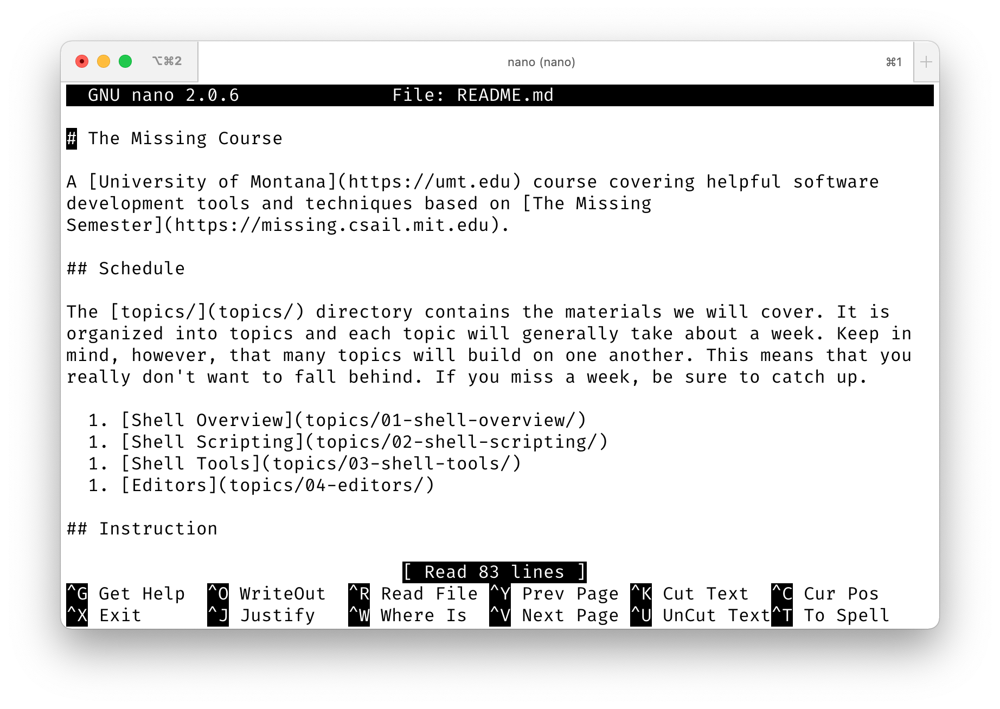
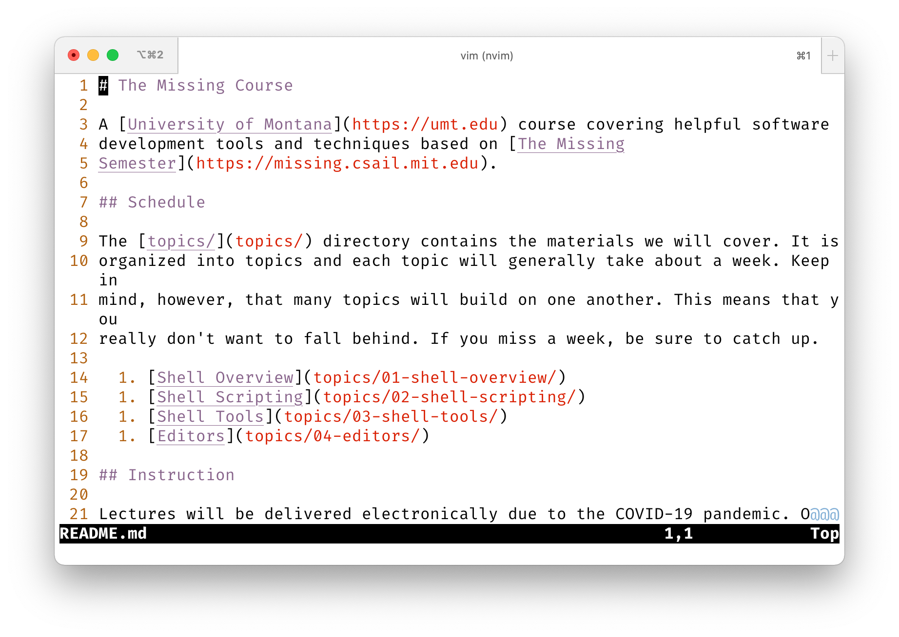

# Editors

We won't spend too much time talking about editors because there are so many of
them in existence and they represent such a subjective, personal choice on the
part of individual users. However, it is good to be familiar with at least a
couple of standard Unix editors since they are essentially ubiquitous and we
don't always have access to our preferred one in all circumstances.

## Nano

Nano is a simple editor that has very few features but is also trivial to learn.
It is common to see people new to Unix using Nano, and there's nothing wrong
with that.

```
nano <file>
```



Note that keyboard shortcuts are displayed at the bottom of the screen, perfect
for new or infrequent users!

## Vim

Vim is kind of the anti-Nano. It is extremely powerful, but rather difficult to
learn.

```
vim <file>
```



There is a common joke that the only way to exit Vim is to shut off the
computer. Can you see why?

### Basic Commands

The commands we discussed in lecture are listed below. Remember that you'll need
to be in Normal mode for these to work. If you are in Insert mode, hit the
`Esc` key to get back to Normal mode.

| Command            | Description                            |
| -------            | -----------                            |
| `h`, `j`, `k`, `l` | left, down, up, right (respectively)   |
| `w`, `b`           | right or left by one word              |
| `gg`, `G`          | top, bottom of the file                |
| `^`, `$`           | beginning, end of the line             |
| `:<number>`        | jump to line by number                 |
| `/`                | find in file                           |
| `d`                | delete / cut selection                 |
| `dd`               | delete line                            |
| `zz`, `zt`, `zb`   | current line to center, top, or bottom |
| `y`                | yank (copy) selection                  |
| `p`                | paste                                  |
| `v`                | visual selection mode                  |
| `V`                | visual line selection mode             |
| `:w`               | save file                              |
| `:q`               | quit or close window                   |

## Emacs

A common joke about Emacs is that it is a great operating system that just lacks
a text editor. There is some strange truth to this, and if you decide to drink
enough of the Kool-Aid you'll understand why.

